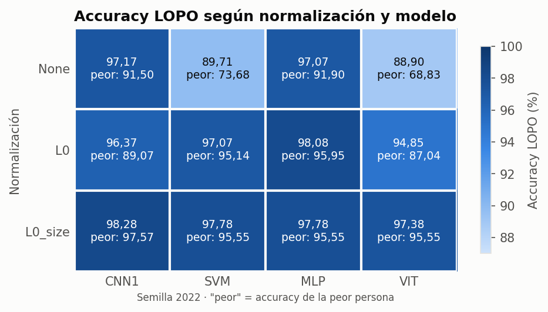
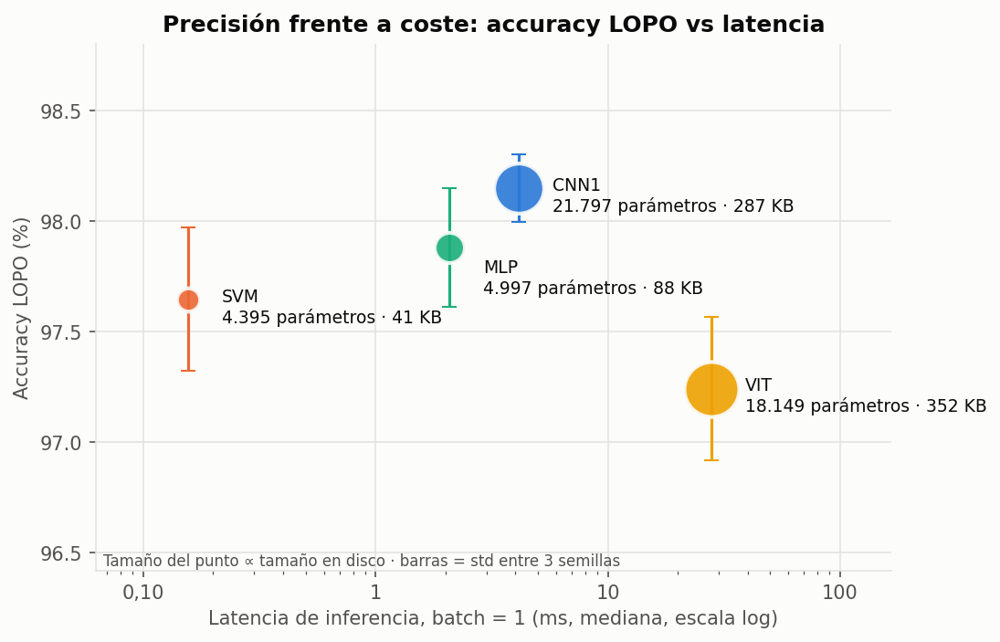
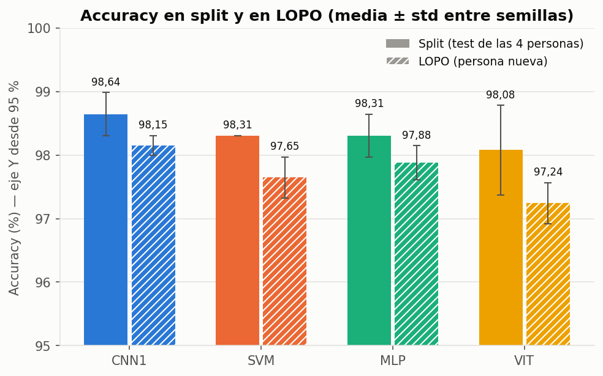
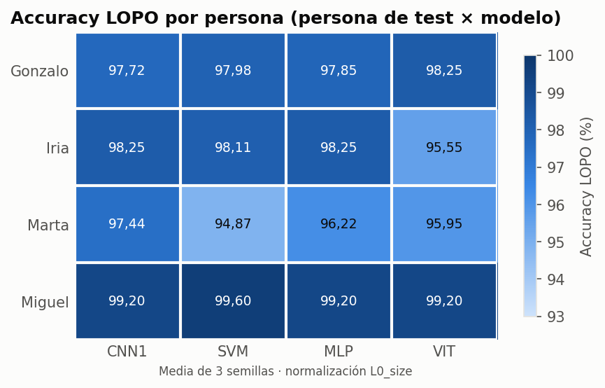
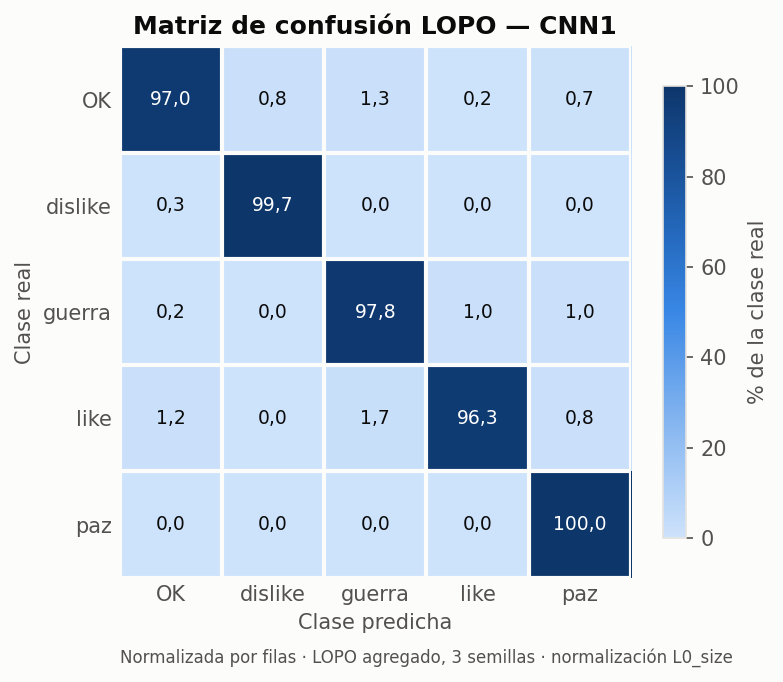
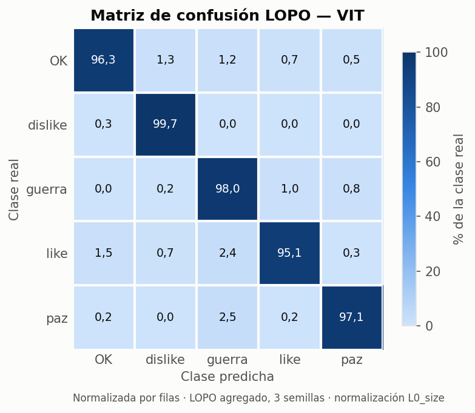
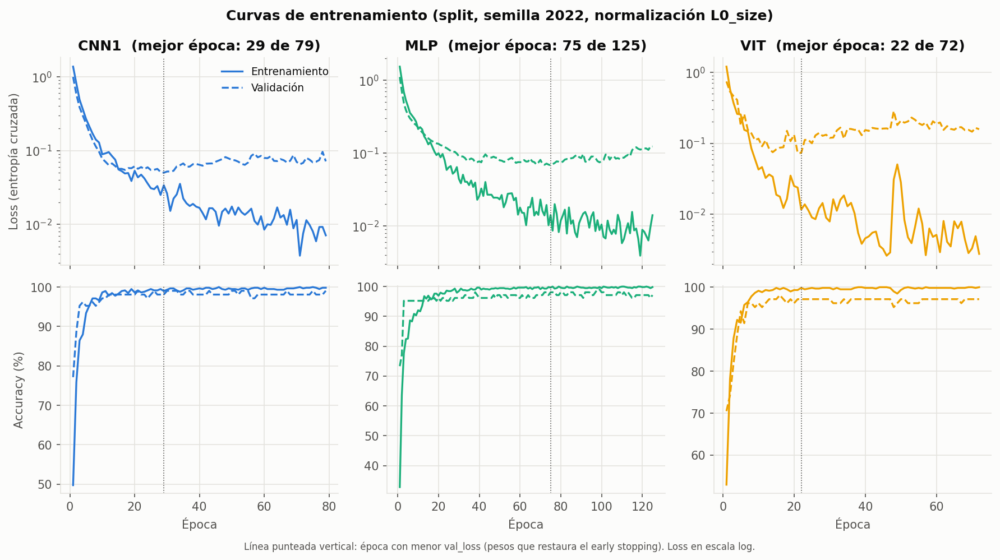

# Comparativa de modelos para el reconocimiento de gestos estáticos de mano

Este documento compara la CNN actual (CNN1, la que usa la demo) con tres alternativas: **SVM**, **MLP** y un
**Vision Transformer (VIT)** adaptado a landmarks. Se comparan en precisión y en coste computacional.

Todos los números salen de `data/results/comparison.csv` y `data/results/comparison_summary.csv`, generados por
`src/compare_models.py`. Las tablas y figuras las genera `src/plot_results.py`. Las tablas completas, listas para
copiar, están en [`data/results/tablas.md`](data/results/tablas.md) y en CSV para Excel
(`data/results/tabla_comparativa.csv` y `data/results/tabla_normalizacion.csv`, con separador `;` y coma decimal).

Para reproducirlo, desde la raíz del repo:

```console
python HAR_mediapipe/src/compare_models.py --models CNN1 SVM MLP VIT --norm L0_size --eval both --seeds 2022 2023 2024
python HAR_mediapipe/src/compare_models.py --norm all --eval lopo --seeds 2022
python HAR_mediapipe/src/plot_results.py
```

---

## 1. Dataset

- **4 personas:** Gonzalo, Iria, Marta y Miguel (`data/dataset_pids_<persona>/`).
- **5 clases:** `OK`, `dislike`, `guerra`, `like` y `paz`.
- **Features por muestra:** 21 landmarks de mano de MediaPipe × (x, y), es decir, 42 features.
- **Muestras:** 991 en total, unas 50 por clase y persona, así que el dataset está balanceado.
  - Partición de cada persona: unas 35 de train y 15 de test por clase.
  - Train: 696 muestras. Test: 295.

| Persona | Train | Test | Total |
|---|---|---|---|
| Gonzalo | 175 | 73 | 248 |
| Iria | 174 | 73 | 247 |
| Marta | 173 | 74 | 247 |
| Miguel | 174 | 75 | 249 |

## 2. Normalizaciones

| Modo | Qué hace | Invarianza |
|---|---|---|
| `None` | Coordenadas de MediaPipe tal cual (x, y ∈ [0,1] relativas al ancho/alto de la imagen) | Ninguna |
| `L0` | Resta la muñeca (landmark 0) a todos los puntos → la muñeca pasa a ser el origen | Posición en la imagen |
| `L0_size` | L0 + divide por la longitud de la palma (landmark 0 → landmark 9) → la palma mide 1 | Posición, distancia a la cámara y tamaño de mano |

Resultados por normalización (figura 5). Accuracy LOPO en %, semilla 2022; entre paréntesis, la accuracy de la
peor persona:

| Normalización | CNN1 | SVM | MLP | VIT |
|---|---|---|---|---|
| None | 97,17 (91,50) | 89,71 (73,68) | 97,07 (91,90) | 88,90 (68,83) |
| L0 | 96,37 (89,07) | 97,07 (95,14) | 98,08 (95,95) | 94,85 (87,04) |
| L0_size | 98,28 (97,57) | 97,78 (95,55) | 97,78 (95,55) | 97,38 (95,55) |



- **`L0_size` es la normalización más robusta.** Es la mejor o casi la mejor en los cuatro modelos y, sobre todo, la
  que sube la **peor persona** a más del 95,5 % en todos.
- **El SVM y el VIT son los que más dependen de normalizar.** Sin normalizar (`None`), su peor persona cae al
  73,68 % y al 68,83 %.
- **La CNN1 y el MLP aguantan mejor los datos sin normalizar** (97 % de media), pero también tienen una persona que
  baja al 91–92 %.
- **El MLP con `L0` saca la media más alta de la tabla** (98,08 %). Con una sola semilla, esa diferencia frente a
  `L0_size` no es significativa (ver sección 7).

## 3. Protocolo de evaluación

Todos los modelos se evalúan con el mismo protocolo y la normalización principal `L0_size`:

- **Split:** se entrena con el train de las 4 personas y se evalúa con su test. Las personas del test ya se han
  visto en el entrenamiento, así que mide cómo reconoce el modelo **a gente conocida**.
- **Leave-one-person-out (LOPO):** se entrena con 3 personas (su train y su test) y se evalúa con la 4ª. Se repite
  4 veces, dejando fuera a cada persona.
  - Se reportan la accuracy global (con la matriz de confusión sumada), la de cada persona y la de la **peor
    persona**.
  - Es la métrica "honesta" para una demo: lo que importa es que funcione con **alguien que no ha grabado datos**.
    La forma de la mano, cómo hace cada uno el gesto y la postura frente a la cámara cambian de una persona a otra,
    y el split no lo penaliza.
- **Semillas:** cada configuración se repite con 2022, 2023 y 2024. Se reporta la media ± la desviación típica
  entre semillas.
- **Sin tocar el test para elegir nada:**
  - **Keras (CNN1, MLP, VIT):** early stopping (patience 50, se restauran los mejores pesos) sobre una validación
    estratificada del 15 % sacada del train. Es el mismo esquema que `Train()` de `train_gestures.py`.
  - **SVM:** `GridSearchCV` con C ∈ {0.1, 1, 10, 100} y gamma ∈ {'scale', 0.01, 0.1, 1}, usando una
    `StratifiedKFold(5)` interna solo sobre el train.
  - En LOPO, la búsqueda se repite dentro de cada fold con las 3 personas de entrenamiento. Casi siempre sale C = 10
    con gamma 0.01 o 'scale' (columna `best_params` de `comparison.csv`).
- **Comprobación de que el protocolo coincide:** con la semilla 2022, la CNN1 reproduce exactamente los resultados
  previos de `train_gestures.py`: 98,98 % en split y 98,28 % en LOPO, con una peor persona del 97,57 %.

**Cómo se mide el coste.** Se mide en CPU sobre el modelo entrenado en split (los valores de LOPO son casi iguales):

- **Parámetros entrenables.** En el SVM: nº de vectores soporte × 42 + coeficientes duales + intercepts.
- **Tamaño en disco:** `.keras` para los modelos Keras y `joblib` para el SVM.
- **Tiempo de entrenamiento.** En el SVM incluye la búsqueda de hiperparámetros completa (16 combinaciones × 5
  folds + el reentrenamiento final).
- **Latencia con batch = 1:** 50 llamadas de calentamiento y después 1000 llamadas medidas. Se dan la mediana y el
  p95. En Keras se usa `model(x, training=False)` y en el SVM `pipeline.predict(x)`.
- **Throughput con batch = 256.**

## 4. Modelos

- **CNN1 (baseline).** Entrada (21, 2, 1). Conv2D de 16 filtros (5×1, ReLU) → Dropout(0.3) → Flatten → Dense(32) →
  Dropout(0.3) → Dense(5, softmax). La convolución recorre la secuencia de landmarks, de modo que cada filtro ve 5
  puntos consecutivos (por ejemplo, las falanges de un mismo dedo). La arquitectura es la de `train_gestures.py`,
  sin cambios.
- **SVM.** `StandardScaler` + `SVC(kernel='rbf')` sobre el vector plano (42,), con `probability=False` para que la
  inferencia sea más rápida. No aprende una representación: separa las clases con un kernel gaussiano en el espacio
  de coordenadas normalizadas.
- **MLP.** Entrada (42,). Dense(64, ReLU) → Dropout(0.3) → Dense(32, ReLU) → Dropout(0.3) → Dense(5, softmax).
  Mismo optimizador (AdamW, lr 1e-3) y early stopping que la CNN.
- **VIT ("landmark = patch").** En un ViT de imagen, la imagen se trocea en *patches*, cada patch se proyecta a un
  vector (token) y un Transformer hace que los tokens se atiendan entre sí. Aquí **cada landmark es un patch**:
  - **Tokens:** su (x, y) se proyecta con Dense(32) a un token. Se añade un token CLS aprendido y un embedding
    posicional aprendido (22 posiciones), que le dice al modelo qué punto de la mano es cada token.
  - **Bloques:** 2 bloques Transformer pre-norm. Cada uno tiene LayerNorm → MultiHeadAttention (4 cabezas,
    key_dim 8, dropout 0.1) + residual, y LayerNorm → MLP (64 → 32, GELU, dropout 0.1) + residual.
  - **Salida:** LayerNorm, se toma el token CLS y Dense(5, softmax).
  - **Tamaño:** 18.149 parámetros, por debajo del límite de 50k. Converge con lr 1e-3, así que no hizo falta bajarlo.
  - La atención permite que cualquier punto "mire" a cualquier otro (por ejemplo, la punta del pulgar respecto a la
    muñeca), en vez de solo a sus vecinos como en la CNN.

## 5. Tabla comparativa principal

Normalización `L0_size`, media ± std entre 3 semillas. El coste corresponde al modelo de split.

| Modelo | Parámetros | Tamaño (KB) | T. entrenamiento (s) | Latencia mediana / p95 (ms) | Throughput (muestras/s) | Acc split (%) | Acc LOPO (%) | Peor persona LOPO (%) | F1 macro LOPO |
|---|---|---|---|---|---|---|---|---|---|
| CNN1 | 21.797 | 287,0 | 18,0 | 4,131 / 5,893 | 44.411 | 98,64 ± 0,34 | 98,15 ± 0,15 | 97,44 | 0,9815 |
| SVM | 4.395 | 40,9 | 2,2 | 0,156 / 0,360 | 124.268 | 98,31 ± 0,00 | 97,65 ± 0,32 | 94,87 | 0,9764 |
| MLP | 4.997 | 87,8 | 14,9 | 2,075 / 2,902 | 87.938 | 98,31 ± 0,34 | 97,88 ± 0,27 | 96,22 | 0,9788 |
| VIT | 18.149 | 352,0 | 51,2 | 27,811 / 38,509 | 3.058 | 98,08 ± 0,71 | 97,24 ± 0,32 | 95,41 | 0,9725 |

Intervalos de confianza al 95 % (`CalculateCI`, sobre 295 muestras en split y 991 en LOPO):

| Modelo | Acc split (%) ± IC | Acc LOPO (%) ± IC |
|---|---|---|
| CNN1 | 98,64 ± 1,31 | 98,15 ± 0,84 |
| SVM | 98,31 ± 1,47 | 97,65 ± 0,94 |
| MLP | 98,31 ± 1,47 | 97,88 ± 0,90 |
| VIT | 98,08 ± 1,55 | 97,24 ± 1,02 |

Accuracy LOPO de cada persona (%, media de 3 semillas):

| Persona | CNN1 | SVM | MLP | VIT |
|---|---|---|---|---|
| Gonzalo | 97,72 | 97,98 | 97,85 | 98,25 |
| Iria | 98,25 | 98,11 | 98,25 | 95,55 |
| Marta | 97,44 | 94,87 | 96,22 | 95,95 |
| Miguel | 99,20 | 99,60 | 99,20 | 99,20 |

## 6. Figuras

Están todas en `data/results/figures/`.

**Figura 1. Precisión frente a coste.**

La latencia ocupa más de dos órdenes de magnitud (0,156 ms el SVM frente a 27,811 ms el VIT), mientras que la
accuracy LOPO solo se mueve entre el 97,24 % y el 98,15 %. El coste diferencia mucho más a los modelos que la
precisión.

**Figura 2. Accuracy en split y en LOPO.**

Todos los modelos pierden entre 0,4 y 0,9 puntos al pasar a una persona nueva: MLP 0,43, CNN1 0,49, SVM 0,66 y
VIT 0,84. La CNN1 es la más estable entre semillas en LOPO (std 0,15). El eje Y empieza en 95 % para que se vean las diferencias.

**Figura 3. Accuracy LOPO por persona.**

Marta es la persona más difícil para casi todos los modelos (94,87 % el SVM, 96,22 % el MLP), salvo para el VIT, que
falla más con Iria (95,55 %). La CNN1 es la única que se mantiene por encima del 97,4 % con todas las personas.

**Figura 4. Matrices de confusión LOPO del mejor modelo (CNN1) y del peor (VIT).**
 
Los errores son pocos y están repartidos. `paz` (CNN1) y `dislike` (los dos modelos) son casi perfectas. La clase
que más se confunde es `like`, sobre todo con `guerra` y con `OK`.

**Figura 5. Normalización × modelo.** Es la figura de la sección 2.

**Figura 6. Curvas de entrenamiento (split, semilla 2022).**

- Los tres modelos alcanzan casi el 100 % en train y entre el 97 % y el 98 % en validación en pocas épocas.
- La val_loss toca fondo pronto (época 29 la CNN1, 75 el MLP y 22 el VIT) y luego sube un poco mientras la loss de
  train sigue bajando: es un sobreajuste leve.
- El early stopping restaura justo los pesos de ese mínimo.
- El VIT es el que más sobreajusta: tiene la mayor separación entre train y validación y los picos de train más
  inestables.

## 7. Discusión

**¿Hay diferencias reales de precisión?** Prácticamente no.

- En LOPO, los cuatro modelos están entre el 97,24 % y el 98,15 %. La diferencia máxima (CNN1 frente a VIT,
  0,91 puntos) es del orden del IC al 95 % de cada modelo (±0,84 a ±1,02), y los intervalos se solapan.
- Entre CNN1, MLP y SVM, las diferencias de 0,27 a 0,50 puntos son del orden de la std entre semillas (0,15 a 0,32).
- Además, el IC asume muestras independientes. En realidad, las muestras de una misma persona están muy
  correlacionadas, así que la incertidumbre real es mayor que la que indica el IC.
- Lo único que se ve de forma consistente es que **la CNN1 tiene la mejor peor persona** (97,44 % frente a 94,87 %
  a 96,22 % del resto) y la menor variación entre semillas. Esa es su ventaja de verdad, más que la media.

**¿Compensa el coste extra del VIT o de la CNN frente al SVM o el MLP?**

- **El VIT no compensa.** Frente a la CNN1 tiene unos parámetros parecidos (18.149 frente a 21.797), ocupa más en
  disco (352,0 KB), tarda casi 3 veces más en entrenar (51,2 s), es unas 7 veces más lento en inferencia
  (27,811 ms) y no mejora la precisión, que es la más baja. Con 21 tokens y menos de 1000 muestras, la atención no
  tiene nada que aprender que no capten ya una convolución o un MLP. Un Transformer necesita muchos más datos para
  sacar ventaja.
- **El SVM es el más eficiente:**
  - Ocupa 40,9 KB y tarda 0,156 ms por muestra, unas 26 veces menos que la CNN1.
  - Entrena en 2,2 s, con la búsqueda de hiperparámetros incluida.
  - Pierde solo 0,50 puntos de media en LOPO, pero su peor persona es la más baja (94,87 %).
- **El MLP es el término medio.** Tiene 4.997 parámetros, tarda 2,075 ms y ocupa el segundo puesto en precisión
  (97,88 %, peor persona 96,22 %).
- **La CNN1** cuesta unos 4 ms por muestra, que en la práctica es despreciable.

**¿Qué modelo elegimos para la demo en tiempo real?** **Mantenemos la CNN1.**

- La demo captura a 15 FPS (`CameraConfig(FPS=15)` en `demo-custom-dataset.py`), es decir, unos 67 ms por frame.
  Los 4,131 ms de mediana (5,893 ms en p95) de la CNN1 son una parte pequeña de ese margen, así que su coste no es
  un problema.
- A cambio, es el modelo más preciso y, sobre todo, el más fiable con una persona nueva (mejor peor persona y menor
  std).
- Si la demo tuviera que ir en un hardware mucho más limitado, la alternativa sería el SVM (o el MLP, si se quiere
  seguir en Keras), aceptando una peor persona algo más baja.
- El VIT queda descartado: es el único cuya latencia (27,811 ms de mediana, 38,509 ms en p95) se come una parte
  importante del margen por frame, y no aporta precisión.

**¿Qué clases se confunden y por qué?** Se miran las matrices LOPO agregadas de 3 semillas, con entre 591 y 600
muestras por clase.

- **`like` es la clase más difícil.**
  - La CNN1 la confunde 10 veces con `guerra` y 7 con `OK`. El VIT, 14 veces con `guerra` y 9 con `OK`.
  - En `like`, `OK` y `guerra` el pulgar o los dedos extendidos ocupan zonas parecidas respecto a la muñeca.
  - Además, en un `like` visto de lado los dedos recogidos se solapan en la imagen, y MediaPipe estima peor sus
    landmarks.
- **`like` y `dislike` casi no se confunden** (0 errores en la CNN1, 4 de `like` → `dislike` en el VIT), aunque
  son la misma forma de mano girada 180°.
  - El motivo es que ninguna normalización quita la orientación: `L0_size` traslada y escala, pero no rota.
  - Por eso un pulgar hacia arriba y uno hacia abajo tienen coordenadas y opuestas respecto a la muñeca, y son de los
    pares más fáciles de separar.
  - Si en el futuro se añadiera una normalización de rotación, esas dos clases pasarían a ser indistinguibles.
- **El VIT confunde además `paz` con `guerra` 15 veces** (la CNN1, ninguna). Son dos gestos que se diferencian solo
  en qué dedos están extendidos, y el VIT, más sobreajustado, generaliza peor esa diferencia fina.

**¿Por qué no hemos hecho data augmentation?** Los números no lo justifican:

1. **La baseline ya está cerca del techo.** La CNN1 saca un 98,15 % en LOPO con una peor persona del 97,44 %, y
   sobre 991 muestras eso son unos 18 errores en total. El margen que podría ganar el augmentation es más pequeño que
   el IC (±0,84).
2. **La normalización ya hace el trabajo del augmentation geométrico.** Los augmentations típicos para landmarks
   (traslación, escalado) son justo las variaciones que `L0_size` elimina por construcción. La figura 5 lo muestra:
   - Al pasar de `None` a `L0_size`, la peor persona sube de 91,50 % a 97,57 % en la CNN1, de 73,68 % a 95,55 % en
     el SVM y de 68,83 % a 95,55 % en el VIT.
   - Es decir, la invarianza que se buscaría con augmentation ya está conseguida.
3. **La variación que queda viene de las personas**, no de la geometría: cómo hace cada uno el gesto y la anatomía de
   su mano. Eso se arregla mejor grabando más personas que generando muestras sintéticas.

## 8. Limitaciones

- **Dataset pequeño:** solo 4 personas y 991 muestras. LOPO con 4 folds da una estimación con mucha varianza entre
  personas, y es difícil asegurar que el resultado se mantenga con una 5ª persona muy distinta.
- **Solo gestos estáticos:** un frame por muestra, sin información temporal. Además, solo se usan x e y; la
  profundidad z de MediaPipe se descarta.
- **Coordenadas no isotrópicas:** MediaPipe normaliza x por el ancho de la imagen e y por el alto. Con una cámara
  16:9, una misma distancia física vale distinto en x que en y, así que la longitud de palma con la que escala
  `L0_size` cambia algo según la orientación de la mano en la imagen. Se podría corregir
  multiplicando x por la relación de aspecto antes de normalizar, pero no se ha hecho para no cambiar el modelo
  actual ni la demo.
- **Latencias medidas en un portátil (CPU, WSL2)** y con `model(x, training=False)` en modo eager, como pide el
  protocolo. Son valores relativos entre modelos, no absolutos: con un `tf.function` o con TFLite, los modelos Keras
  bajarían bastante, sobre todo el VIT, que es el más penalizado por la sobrecarga eager de MultiHeadAttention.
- **Una sola semilla en la tabla de normalizaciones** (pasada barata). Ahí las diferencias de menos de 1 punto no son
  concluyentes.
